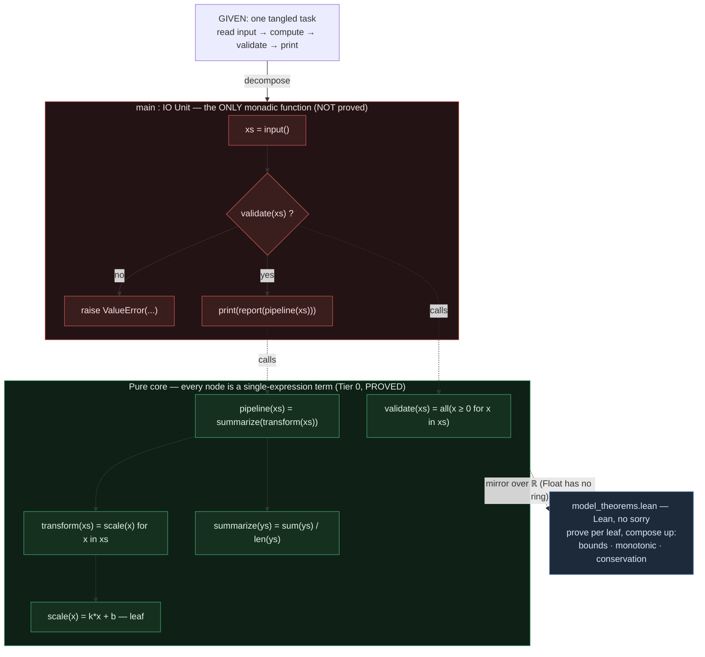

# Writing Python that transpiles to *provable* Lean

Based on the current implementation of py2lean, the transpiler emits Lean that is **provable**
only if the Python code is non-monadic. Monadic verification is not yet supported. This document
explains how to structure Python code to maximize the provable surface of the transpiled Lean.

**The one idea:** write each piece of math as a **single Lean *term*** (no `do` block). Those are
the functions we can prove theorems about today — `ring` / `simp` / `grind` / `nlinarith` work on
them directly. The moment a function compiles to a `do` block — whether from a loop, mutation,
`print`, `input`, or `raise` — it is **out of reach of proofs in the current workflow**. So the
whole game is: **maximize the functions that stay a single term.**

> Worked proof example in this repo: `example_scripts/showcase/scipy/pk_theorems.lean` proves
> mass-balance and per-step drug-accounting about the *term-shaped* functions in
> `example_scripts/showcase/scipy/pk_model.py`. Their being single expressions is what made the
> proofs one-liners.

---

## 1. The principle

Keep the **math as pure expressions** — functions that take data and return a value computed by
one expression. Do everything else — reading input, printing, raising errors — only at the
**edge of the program** (`main`).

| Edge (`main`) — not proved | Pure math — proved |
|---|---|
| `input()` / read files | data in → value out |
| `print()` / write output | one expression per function |
| `try` / `except` / `raise` (validation, errors) | no loops, no mutation, no `print`/`input`/`raise` |

The edge calls the math; **the math never reads input, prints, or raises.** A math function that
is one expression becomes a bare Lean term — provable. Everything pushed to the edge is what we
*don't* try to prove.

---

## 2. What keeps a function a provable term — and what breaks it

A function compiles to a **bare Lean term (Tier 0, provable)** only if its whole body is a single
expression. **Anything that introduces a `do` block takes it out of Tier 0**, for one of two
reasons:

| Reason a `do` block appears | Python | Becomes | Provable today? |
|---|---|---|---|
| **Loops / mutation / early-return statements** | `for`, `while`, `x = …` / `+=`, `if …: return …` then more | `Id.run do …` (pure `Id` monad) | ❌ not yet (Tier 1) |
| **IO** | `print(...)`, `input()` (+ any caller) | `… → IO _` | ❌ not yet (Tier 2) |
| **Exceptions** | `raise`, `try` / `except` (+ any caller) | `… → PyExcept _` | ❌ not yet (Tier 2) |

`Id.run do` *is* pure (the `Id` monad), so it's pure-in-principle — but it's still a `do` block,
and proving through `do` blocks isn't supported yet. **For today's purposes, treat loops and
mutation exactly like `print`/`raise`: they cost you the proof.**

> Both IO and exceptions are **infectious** — one `print` or `raise` deep in the call graph turns
> every function above it monadic. (Mechanism: `src/py2lean.py` stamps `effect_mode`
> "io"/"except" on those nodes and their transitive callers; `PyGens/Core/Utils.lean`
> `jsonUsesIOEffect`/`jsonUsesExceptionEffect` detect it; `PyGens/UseCases/FuncDef.lean` casts
> the body to `IO`/`PyExcept`.)

---

## 3. "Which loop keeps me in Tier 0?" — none; loop *functionally*

**No `for`/`while` statement is Tier 0.** Even the most basic loop compiles to `Id.run do`:

```python
def basic_for(xs: list[int]) -> int:
    s = 0
    for x in xs:        # ← any for/while → Id.run do (Tier 1, not provable yet)
        s = s + x
    return s
```
```lean
def basic_for := fun (xs : List Int) ↦ Id.run (do let mut s := 0; for x in … ; return s)   -- ❌ Tier 1
```

To iterate while staying a **single term**, replace the loop with a value-producing expression:

| Instead of a loop, write… | Lowers to (bare term) | Tier 0 |
|---|---|---|
| `sum(xs)` / `sum(f(x) for x in xs)` | `pySum xs` / `pySum (List.map …)` | ✅ |
| `[f(x) for x in xs]` | `List.map (fun x => …) (pyIter xs)` | ✅ |
| `[x for x in xs if p(x)]` | `pyFilter …` | ✅ |
| `all(p(x) for x in xs)` / `any(...)` | `pyAll …` / `pyAny …` | ✅ |
| `min(xs)` / `max(xs)` | `pyMin …` / `pyMax …` | ✅ |
| `reduce(lambda a,b: …, xs, init)` (from `functools`) | `Libraries.functools.pyReduce …` | ✅ |
| `zip(xs, ys)` | `pyZip xs ys` | ✅ |
| recursion (body is one expression) | recursive `def` term | ✅ |

```python
def basic_for(xs: list[int]) -> int:
    return sum(xs)                              # ✅ Tier 0 → pySum xs

def dot(xs: list[float], ys: list[float]) -> float:
    return sum(a * b for a, b in zip(xs, ys))   # ✅ Tier 0
```

**So: comprehensions and `sum`/`map`/`filter`/`reduce`/`all`/`any`/`min`/`max`/`zip` (and
recursion) are your loops if you want to prove things.** A literal `for`/`while` is not.

---

## 4. Stay in a *term*: the other Tier-0 rules

Besides avoiding loops, two more things drop you out of Tier 0:

- **Mutation** (`x = …` reassignment, `x += …`, building up a variable) → `Id.run do`. Compute the
  result as one expression instead.
- **Statement `if` with an early `return`** → `Id.run do`. Use an **`if`/`else` *expression*
  (ternary) instead — it stays a term:

```python
def f(x: int) -> int: return x if x > 0 else -x   # ✅ Tier 0 → if … then … else … (term)
def g(x: int) -> int:                              # ❌ Tier 1 → Id.run do
    if x > 0: return x
    return -x
```

Everything that *is* fine inside a Tier-0 term: arithmetic, comparisons, boolean ops, ternaries,
nested calls to other term-shaped functions, list/dict/set literals, comprehensions, and the
functional builtins above.

---

## 5. Operation reference

| Python construct | Lean shape | Provable today? |
|---|---|---|
| `a + b`, `a * b`, `-a`, `a % b`, `a ** b` | `a +ₚ b`, … (term) | ✅ Tier 0 |
| `a < b`, `a == b`, `a and b`, `not a` | term | ✅ Tier 0 |
| `x if c else y` (ternary) | `if … then … else …` (term) | ✅ Tier 0 |
| `return <expr>` (single / tail) | the expression (term) | ✅ Tier 0 |
| `sum`/`map`/`filter`/`reduce`/`all`/`any`/`min`/`max`/`zip`, comprehensions | term | ✅ Tier 0 |
| recursion (one-expression body) | recursive `def` term | ✅ Tier 0 |
| `for`, `while` | `Id.run do … for/while …` | ❌ Tier 1 (not yet) |
| `x = …` reassign, `x += …`, `let mut` | `Id.run do` / reassign | ❌ Tier 1 (not yet) |
| statement `if` with early `return` | `Id.run do` | ❌ Tier 1 (not yet) |
| `print(...)` | `pyPrintIO …` → `IO _` | ❌ Tier 2 |
| `input()` | `pyInputIO …` → `IO _` | ❌ Tier 2 |
| `raise ...` | `throw …` → `PyExcept _` | ❌ Tier 2 |
| `try` / `except` | `try/catch … : PyExcept _` | ❌ Tier 2 |
| call to an IO/raising function | infected → `IO`/`PyExcept` | ❌ Tier 2 |

---

## 6. The recipe — maximize Tier 0

1. **One or few expression per math function.** Aim for a single `return <expr>` or a set of expressions to make a meaningful function. If you're tempted to
   write a loop, reach for a comprehension / `sum` / `map` / `filter` / `reduce` / recursion.
2. **No mutation, no `for`/`while`** in functions you want to prove. (They're pure, but Tier 1 —
   not provable yet.)
3. **Ternary, not statement-`if`-with-return.** `return a if c else b`, not `if c: return a`.
4. **All `input()` at the edge** (`main`); pass plain data into the math as arguments.
5. **Return values; `print` only at the edge.** Never debug-print inside math (it makes the whole
   call chain `IO`).
6. **Never `raise` inside the math.** Return a `bool`/`Option`/sentinel and let the edge validate
   and raise.
7. **No globals.** The math depends only on its arguments.
8. **Annotate types** (`int`, `float`, `list[float]`) so the term gets a concrete Lean signature
   — proofs need it.
9. **Simple Python** Try to avoid fancy python features that don't transpile to Lean (e.g., `with`, `async`, `await`, `yield`). Simplify the Python to a subset most commonly used. You can assume most standard Python features are supported.
tiny pure terms with a single monadic `main` at the root.**

---

## 7. Worked example: before → after

### ✗ Before — tangled; nothing is a provable term

```python
def average_positive():
    n = int(input())                 # IO
    total = 0.0
    xs = []
    for _ in range(n):               # loop + mutation
        v = float(input())           # IO
        if v < 0:
            raise ValueError("neg")  # exception
        xs.append(v)
    for x in xs:                     # loop + mutation
        total = total + x
    avg = total / len(xs)
    print("average:", avg)           # IO
    return avg
```

### ✓ After — math as single-expression terms + a thin edge

```python
# ---- PURE MATH (Tier 0, provable) ----
def average(xs: list[float]) -> float:
    return sum(xs) / len(xs)              # one expression → pySum xs /ₚ pyLen xs

def all_nonneg(xs: list[float]) -> bool:
    return all(x >= 0.0 for x in xs)      # comprehension, no loop

# ---- EDGE (main): input / validate / print — not proved, and that's fine ----
def main():
    n = int(input())
    xs = []
    for _ in range(n):
        xs.append(float(input()))
    if not all_nonneg(xs):                # validate at the edge …
        raise ValueError("neg")           # … raise at the edge
    print("average:", average(xs))        # print at the edge
```

`average` and `all_nonneg` are bare terms (verified: they contain no `do`, `IO`, or `PyExcept`).
The canonical repo example is the same shape — `pk_model.py`'s `depot_rate` / `central_rate` /
`concentration` are single expressions, and `pk_theorems.lean` proves their invariants in one
`grind` each.

---

## 8. Proving it: the companion-theorem workflow

After transpiling, write a hand-authored `*_theorems.lean` that **mirrors the term-shaped
functions over `ℝ`** and proves the invariants. (Mirror over `ℝ`, not `Float`: the generated
functions run on `Float`, where `ring`/`linarith` do **not** hold — IEEE arithmetic isn't a ring.
The expression *structure* is identical, so the proofs are the intended mathematical guarantees.)

Template — see `example_scripts/showcase/scipy/pk_theorems.lean`:

```lean
import Mathlib
namespace MyModel
def rate (k x : ℝ) : ℝ := -k * x          -- mirror of the term-shaped Python function

theorem rate_sign (k x : ℝ) (hk : 0 ≤ k) (hx : 0 ≤ x) : rate k x ≤ 0 := by
  unfold rate; nlinarith [mul_nonneg hk hx]
end MyModel
```

Good theorem targets: **conservation / mass balance**, **monotonicity**, **bounds /
non-negativity**, **per-step accounting**. Finish with `#print axioms my_theorem` to confirm it
rests only on `propext, Classical.choice, Quot.sound` (no `sorry`).

---

## 8b. In-source proofs: `assert` → `theorem` / `have`

The companion file above is hand-written. You can also put the obligation **in the Python source**
as an `assert`: the transpiler turns it into a Lean proof obligation discharged by `taste?` (a
tactic that tries a list of candidates and falls back to `sorry`). These exist only in the prove
(`--mode prove`, `ℚ`) build — the runnable twin (`--mode run`, or the `'rn` twin emitted by the
default `--mode both`) drops them.

The load-bearing rule: **an `assert` keeps its function non-monadic.** A proof obligation buried in
`Id.run do` loses the leverage `ring` / `nlinarith` / `taste?` need, so assert-bearing functions
stay pure terms (a `let`-chain ending in the obligation), never a `do`-block. And the obligation is
lowered as a **`Prop`**, not a `Bool`: `==` becomes `=`, `<` / `≤` become real order relations — no
`decide`, no `= true`.

**Exactly two shapes become a named `theorem`; everything else is a non-monadic `def` with `have`s:**

**1. A lone `assert` → a named `theorem`.** A function whose entire body is one `assert`
(comments/docstrings aside) becomes a top-level `theorem`: the parameters are the
universally-quantified variables, the assert's test is the proposition.

```python
def scale_preserves_total(xs: list[float], c: float):
    assert sum(scaled(xs, c)) == c * sum(xs)
```
→ `theorem scale_preserves_total : ∀ (xs : List ℚ) (c : ℚ), … = … := by taste?`

This is the form to reach for when you want a **named, reusable** lemma — it reads as a first-class
theorem, and the run twin simply drops it.

**2. `if H: assert C` → a theorem with hypotheses.** A bare `assert` leaves every parameter
unconstrained, but most invariants only hold under preconditions. Guard the assert with an `if`: the
guard becomes the theorem's hypotheses, and a conjunction is curried into separate named ones.

```python
def discount_never_raises_price(price: float, rate: float):
    if price >= 0 and rate >= 0:
        assert discounted(price, rate) <= price
```
→ `theorem … : ∀ (price rate : ℚ), price ≥ 0 → rate ≥ 0 → discounted price rate ≤ price := by taste?`

The `if`-guard is exactly the `(h1 : …) (h2 : …)` hypothesis list you'd otherwise write by hand —
`taste?` `intro`s them and hands them to `nlinarith`. The correspondence is one-to-one: **every
hypothesis in the generated Lean theorem comes from one conjunct of the Python `if`** — a guard
`if H1 and H2 and H3:` becomes the curried chain `H1 → H2 → H3 → C`. (Only these two shapes — a lone
`assert`, or `if <guard>: assert` with no `else` — are promoted to a `theorem`.)

**3. Anything else → a non-monadic `def` with in-body `have`s.** Two (or more) asserts, or
statements alongside an assert, do **not** become a theorem. The function stays an ordinary,
**still non-monadic** `def`, and each assert becomes an anonymous `have ht : … := by taste?` threaded
through the body — never `Id.run do`. *Even two bare asserts stay a `def` with two `have`s.* Handy
for an inline sanity check over locally-computed values:

```python
def step_conserves(x: float, v: float, dt: float):
    x_next = x + v * dt
    assert x_next - x == v * dt
```
→ a pure `let x_next := …; have ht : … := by taste?` (no `Id.run do`). Lean still checks it, but it's
an anonymous `have`, not an externally-referenceable named lemma.

**Rule of thumb.** Want a named, reusable theorem → make the property its **own** function with a
single `assert` (use `if H: assert C` when it needs preconditions). Want an inline check over
intermediates → put the `assert` **inside** the function and accept an anonymous `have`. `assert`
(in-source) and the companion `*_theorems.lean` (§8) are complementary: asserts keep the obligation
next to the code and auto-discharge the routine ones; the companion file is for invariants you want
stated independently over `ℝ`, or proved with a bespoke tactic.

---

## 9. Checklist & anti-patterns

**Rules for maximum Tier 0 (provable)**
- [ ] Each math function is a **single expression** (term).
- [ ] No `for`/`while`/mutation in math — use comprehensions / `sum`/`map`/`filter`/`reduce` /
      recursion.
- [ ] Ternary, not statement-`if`-with-`return`.
- [ ] All `input()` at the edge; math takes data as arguments.
- [ ] Math only `return`s values; **all `print` at the edge**.
- [ ] Math never `raise`s; validate + raise at the edge.
- [ ] No globals; type-annotated parameters and returns.
- [ ] A `*_theorems.lean` mirrors the math over `ℝ` and proves its invariants (no `sorry`).

**Anti-patterns (each forfeits the proof)**
- `for`/`while`/mutation in a function you want to prove → `Id.run do` (Tier 1, not provable yet).
- `print(...)` for debugging inside math → whole call chain becomes `IO`.
- `raise` for validation inside math → whole call chain becomes `PyExcept`.
- `input()` sprinkled through the computation instead of read once at the edge.
- Statement `if x: return a` instead of the ternary `a if x else b`.
- Module-level mutable state the math reads/writes.

---

## 10. Architecture: decompose deep, wrap thin

The whole method in one picture. **Take any task, shred its math into Tier-0 functions, compose them upward, and wrap the result in
monadic functions like `main` or others if needed.** Do not shred it too an unnecessary smallness, but enough functionality should be visible.



> Dependencies point **down**: `main` calls the pure core; the core never calls `main`. Every
> core node is a single-expression term (Tier 0), so the whole tree is provable — and *a term
> calling terms is still a term*, so composing them keeps depth free.

**How to apply it to a given chunk of code:**

1. **Find the effects** — every `input`, `print`, `raise`/`try`. Those, and only those, belong in
   `main`. Mark them; everything else is math to extract.
2. **Shred the math into leaves** — pull each computation into its own function that is small enough to make a Tier-0 function. Keep it reasonable so that function made is meaningful.
3. **Compose upward** — build bigger functions by *calling* the leaves
   (`pipeline = summarize(transform(xs))`). **A term that calls terms is still a term**, so the
   whole composed core stays Tier 0 — you pay nothing for depth.
4. **Wrap action in monadic functions** — Outer wrapping monadic functions like `main`(or others) reads input, threads it through the pure core, validates via a
   pure predicate (and raises *there*), and prints the result. It is the single monadic island.
5. **Prove leaf-first** — prove a small lemma about each leaf, then compose them into the top
   theorem (exactly how `pk_theorems.lean`'s `mass_balance` is built from `depot_rate` /
   `central_rate` / `periph_rate`). Small terms ⇒ small proofs ⇒ they compose.

**Why decompose *as much as possible*:** every function you split out is one more independently
provable unit, and because composition preserves Tier 0, splitting never costs you provability —
it only buys you smaller proofs and more reusable lemmas. The ideal end state is a set of non-monadic Tier-0 functions, each of a single or a few compound meaningful statements for which you can write a clean, focused proof.

---

*Pattern background (the "functional core, imperative" idea):
[functional-architecture.org](https://functional-architecture.org/functional_core_imperative_shell/) ·
[Kenneth Lange](https://kennethlange.com/functional-core-imperative-shell/).*
